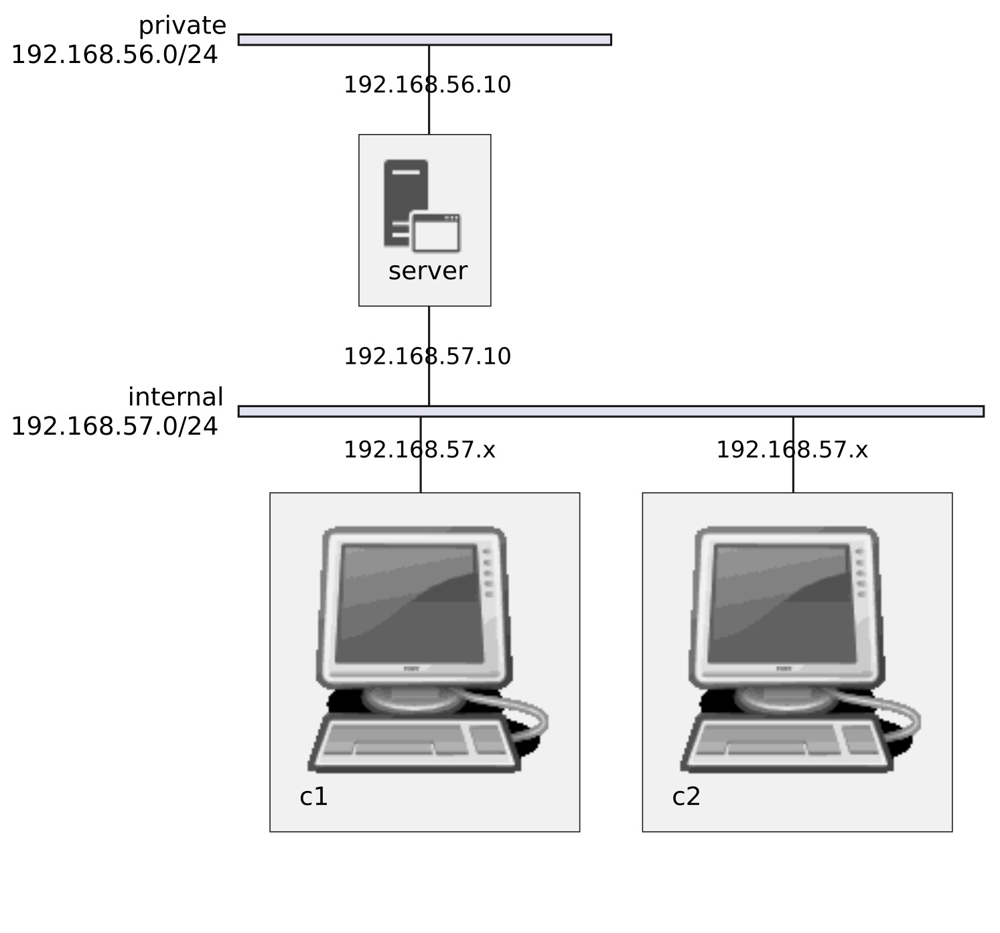

# DHCP SERVER

## :gem: Description

This project sets up a DHCP server on a Linux machine, configuring two virtual clients to receive dynamic IP addresses and one client to always receive a fixed IP based on its MAC address. The DHCP server will be deployed with two network interfaces, and clients will be part of an internal network.

> The server will have two network interfaces. The first interface connects to a private host-only network (192.168.56.0/24), and the second connects to an internal network (192.168.57.0/24). Clients on the internal network will receive IP addresses dynamically or be assigned a fixed IP using MAC-based configuration.

**Network structure:**

|     Machine    |       IP                       |
|----------------|--------------------------------|
| Server         |  192.168.57.10 - 192.168.56.10 |
| client 1       |              DHCP              |
| client 2       |   192.168.57.4   (MAC based)   |


<br>

<div align="center">
    
</div>

>This image has been made using [Kroki](https://kroki.io), you can view the source code [here](./diagram.puml)!


## :gear: Configuration

-DHCP Server:

  -The server will be equipped with two network interfaces. The first interface will connect to a private host-only network (192.168.56.0/24) with the IP address 192.168.56.10, allowing Internet access for downloading necessary packages. The second interface will be set up on an isolated internal network (192.168.57.0/24) with the IP address 192.168.57.10, dedicated to managing DHCP protocol messages.

-General Client Configuration:

    -Clients will receive their IP addresses dynamically from the DHCP server.
    -All clients will be part of the internal network, located at 192.168.57.0/24.

-Specific Configuration for Client 2:

    -Client 2 will always receive the fixed IP address 192.168.57.4 from the DHCP server.
    -The lease time for Client 2 will be set to 1 hour.
    -The DNS server for Client 2 will be configured as 1.1.1.1.

## :wrench: Setup 

To start the virtual machine, simply navigate to the project directory and run the following command:

    ```bash
    vagrant up
    ```
